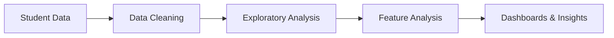

# 🎓 Student Performance Analysis

  

  
  
  
  
  

---

## 📌 Project Overview

The **Student Performance Analysis** project focuses on analyzing academic data to uncover the key factors that influence student performance. The insights generated help educators and institutions make data-driven decisions to improve learning outcomes.

---

## ❓ Problem You Solved

* Analyzed student academic performance to identify factors affecting grades.
* Helped educators understand performance gaps and areas for improvement.

---

## 🔄 Data Pipeline / Workflow

* Collected and cleaned student data (scores, attendance, demographics) using **Python and SQL**.
* Performed analysis and presented insights through **interactive Power BI dashboards**.

---

## 🛠️ Tools & Technologies

| Tool                | Usage                                                  |
| ------------------- | ------------------------------------------------------ |
| 🐍 Python           | Data cleaning, analysis, and basic predictive modeling |
| 🗄️ SQL             | Data extraction and transformation                     |
| 📊 Excel            | Data preprocessing and validation                      |
| 📈 Power BI         | Interactive dashboards and visual analytics            |
| 🤖 Machine Learning | Student performance prediction models                  |

---

## 🚀 Key Features

* Identification of performance-driving factors
* Clear visual representation of academic trends
* Easy-to-understand dashboards for educators

---

## ⚡ Most Challenging Feature Implemented

* Identifying key features influencing student performance using analytical techniques.
* Designing interactive dashboards understandable by non-technical users.

---

## 📊 Sample Visualizations

  
  
  

---

## 🌟 Future Enhancements

* Implement advanced ML models for performance prediction
* Add real-time academic monitoring
* Integrate attendance and behavioral analytics

---

## 🤝 Connect

If you find this project useful, feel free to ⭐ star the repository and connect with me!

  
  

---

📌 *This project showcases practical skills in data analysis, visualization, and educational data analytics using real-world datasets.*
